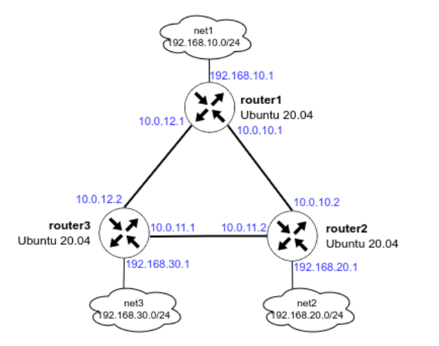

# OSPF

1. Развернул 3 виртуальные машины 
2. При помощи ansible настроил OSPF
- настроил OSPF между машинами на базе FRR;
- изобразил ассиметричный роутинг;
- сделал один из линков "дорогим", но что бы при этом роутинг был симметричным.

